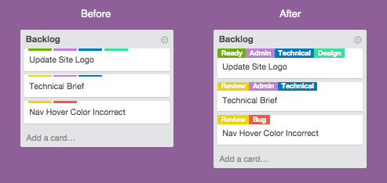

## Card Color Titles for Trello

Show the Card label titles on trello.com for easier communication in a team

| Browser | Link |
| --- | --- |
| Chrome | [Download Extension](https://chrome.google.com/webstore/detail/card-color-titles-for-tre/hpmobkglehhleflhaefmfajhbdnjmgim?utm_source=chrome-ntp-icon) |
| Safari | [Download Extension](https://github.com/ChuckJHardy/ColorTitlesTrello/raw/master/Color%20Titles%20Trello.safariextz) |

## Contributing

    $ git clone git@github.com:ChuckJHardy/CardTitlesTrello.git ~/Downloads/CardTitlesTrello

1. Fork it
2. Create your feature branch (`git checkout -b my-new-feature`)
3. Commit your changes (`git commit -am 'Add some feature'`)
4. Push to the branch (`git push origin my-new-feature`)
5. Create new Pull Request`
